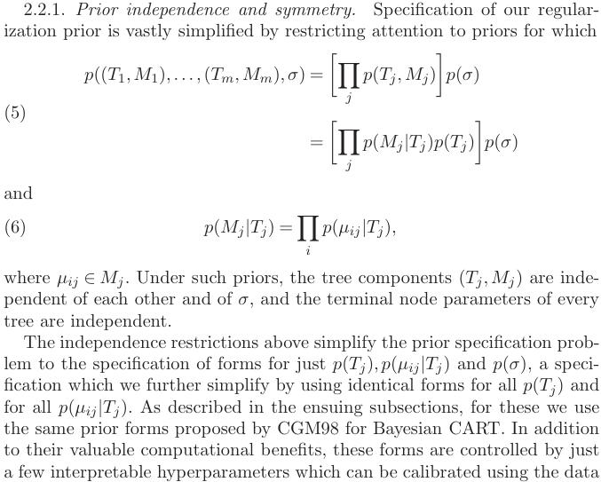

---
title: BARNstorm for ML Form
subtitle: Bayesian Additive Regression Networks
author:
- Danielle Van Boxel
date: 09 Feb 2023
institute: University of Arizona
theme: AnnArbor
colortheme: albatross
fontsize: 10pt
aspectratio: 169
toc: true
toc-title: I Table of Contents
header-includes:
    - \definecolor{branch}{rgb}{0.33,.8,0.99}
    - \definecolor{leaf}{rgb}{0.1,.1,.1}
    - \definecolor{offwhite}{rgb}{0.9,.9,0.9}
    - \definecolor{tan}{rgb}{0.97,0.66,0.72}
    - \usecolortheme[named=leaf]{structure}
    - \setbeamercolor*{palette primary}{bg=branch, fg = leaf}
    - \setbeamercolor*{palette secondary}{bg=tan, fg = leaf}
    - \setbeamercolor*{palette tertiary}{bg=branch, fg = leaf}
    - \setbeamercolor*{palette quaternary}{bg=tan, fg = leaf}
    - \setbeamercolor*{titlelike}{bg=branch, fg = leaf}
    - \setbeamercolor*{section name}{bg=tan, fg = leaf}
    - \setbeamercolor*{subsection name}{bg=branch, fg = leaf}
    - \setbeamercolor*{part name}{bg=tan, fg = leaf}
    - \setbeamercolor*{background canvas}{bg=white, fg = black}
    - \setbeamercolor*{frametitle}{bg=branch, fg = leaf}
    - \setbeamercolor*{frametitle}{bg=tan, fg = leaf}
    - \setbeamercolor*{normal text}{bg=white, fg = black}
    - \usepackage{textpos}
    - \addtobeamertemplate{frametitle}{}{\begin{textblock*}{100mm}(.95\textwidth,-0.9cm)\includegraphics[height=0.9cm,width=0.9cm]{figs/cute_ua.png}\end{textblock*}}
...

# Overall Goals

## Comps Goals: Math and Machine Learning
 
* *More rigorous formulation of machine learning model: Bayesian posterior, NN optimization, and inference usage*
* Better motivation for BARN (automatic architecture search, broad applicability, more background research needed)
* *Ensure understanding of inspirational BART paper (background and MCMC)*
* Exploration and guidance for setting of hyperparameters
* (stretch) Explore convergence properties/error analysis of BARN
    * More rigorous computing of convergence metrics for MCMC
    * Any provable properties/conditions for convergence (and speed of convergence)
    * Or non-convergence
    * Explore Gelman-Rubin statistic
* (stretch) Development of Support Vector Machine for BARN
* (stretch) Develop more general neural network architecture for BARN to explore

## Comps Goals: Data Science and Implementation

* *Refactor BARN code into Python module with arbitrary base model.*
* *Write practical tutorial with small example for users.*
* (stretch) Develop R library as well.
* (stretch) Improve speed by order of magnitude by cleverly implementing ensemble of NNs.
* (stretch) Implement classification form of BARN (e.g. Probit model)
* Inclusion of additional data sets (larger scale or demonstrating some capability/problem with BARN).
* Expansion of testing metrics/procedure

# Progress

## Some Lit Review

* Hastie, Tibshirani, and Friedman.  2009.  Elements of Statistical Learning.
    * Ch 8.6: MCMC for sampling from posterior
    * Still trying to understand how to adapt this formulation to model training
* Neal. 1996.  Bayesian Learning For Neural Networks
    * Uses Hybrid MC to sample from space of NN weights
    * Could this be integrated into my NN approach to avoid lengthy training with backpropagation?  More reading required.
* Chipman, George, and McCulloch.  2010.  BART.
    * Adapting my formulation to be similar to their.  Replace "sum-of-trees" with "sum-of-NNs".

## BART Prior

::: columns
:::: {.column width=55%}

{ height=80% }

::::
:::: {.column width=45%}

* $(T_j, M_j) =$ Decision tree parameters (node splits and terminal values)
* $\mu_{ij} =$ Terminal value of node $i$ in tree $j$
* $\sigma =$ Standard deviation of the error term
* Better understanding may inform prior specification for BARN.
    * Prior on number of neurons
    * Essentially no prior on weights themselves

::::
:::

## BARN ML Formulation

$$
\begin{aligned}
y_i &= u(x_i) + \epsilon_i \quad \epsilon_i \sim N(0,\sigma^2)\\
E(y_i|x_i) &= u(x_i)\\
\text{Seek } f(x_i) &\approx u(x_i)\\
g_j(x_i; M_j,w_j) &= \text{NN defined by (arch,weights), } (M_j, w_j)\\
\text{Let } f(x_i) &= \sum_{j=1}^K g_j(x_i; M_j,w_j)\\
\end{aligned}
$$

Sample $M_j$ from posterior using MCMC (see next slide).  Learn $w_j$ using optimization on $g_j(x_i; M_j,\hat{w_j}) \approx R_{ij} = y_i - \sum_{k=1; k\neq j}^K g_k(x_i; M_k,w_k)$.

## BARN Posterior

::: columns
:::: {.column width=50%}

$$
\begin{aligned}
P(w_j) &= P(w_j') \text{ No prior on weights} \\
P(M_j|w_j) & = P(M_j)\\
P(M_j,w_j | R_j,X) &=\frac{P(R_j|M_j,w_j,X)P(M_j)}{P(R_j)}\\
\implies \frac{P(M_j,w_j | R_j,X)}{P(M_j',w_j' | R_j,X)} &=\frac{P(R_j|M_j,w_j,X)P(M_j)}{P(R_j|M_j',w_j',X)P(M_j')}\\
A(M_j, M_j') = min(1, &\frac{T(M_j', M_j) P(R_j|X,M_j') P(M_j')}{T(M_j, M_j') P(R_j|X,M_j) P(M_j)})
\end{aligned}
$$

::::
:::: {.column width=50%}

* $M_j =$ Model architecture (i.e. number of neurons) of network $j$
* $w_j =$ Model weights of network $j$
* $M_j' =$ Mutant model proposed by MCMC
* $T(M_j, M_j') =$ Transition probability between old and new model (does not depend on weights)
* $P(R_j|M_j) =$ Error likelihood of seeing residual $R_j$ given model, $M_j$, and wieghts, $w_j$.
* $P(M_j) =$ Prior probability of model architecture
* $P(w_j) =$ Prior probability of model weights (effectively no information)
* $A(M_k,M_k') =$ MCMC acceptance probability of mutant model
::::
:::

## Other Work

* Started skeleton repository with setup for [documentation](https://dvbuntu.github.io/barmpy/)
* Drafted academic website, available at [https://dvbuntu.github.io/](https://dvbuntu.github.io/), still adding publications
* Reviewed old resume/CV; need to update since 2019 and make clean for wider availaability
* Accepted invitation to Speak at Women in Data Science Conference 2023, April 21, Afternoon.  Will describe BART theory and applications.

# Plans

## Schedule

{ height=140% }

## Next Time (23 Feb 2023)

* Clarify NN optimization steps
* Update comps draft with these explanations and additional review
* Start drafting/citing for motivating BARN (arch search, general applicability, where do other methods fail, what does BART add to trees)
* (stretch) Start to sketch/setup hyperparameter exploration (look for general Python libs to handle for comparing against other methods and including cross-validation)

## Links

Email: vanboxel@math.arizona.edu

Old Repo: [https://github.com/dvbuntu/barn](https://github.com/dvbuntu/barn)

Math Repo: [https://github.com/dvbuntu/barm](https://github.com/dvbuntu/barm)

Library Repo: [https://github.com/dvbuntu/barmpy](https://github.com/dvbuntu/barmpy)

## Bibliography

\footnotesize

[//]: # (Fixing highlighting_)
